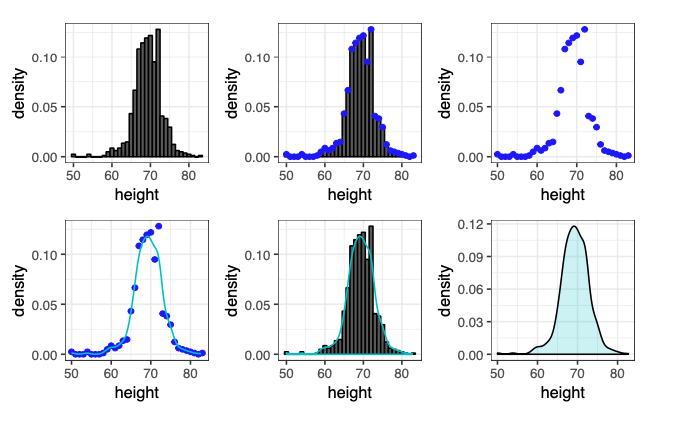
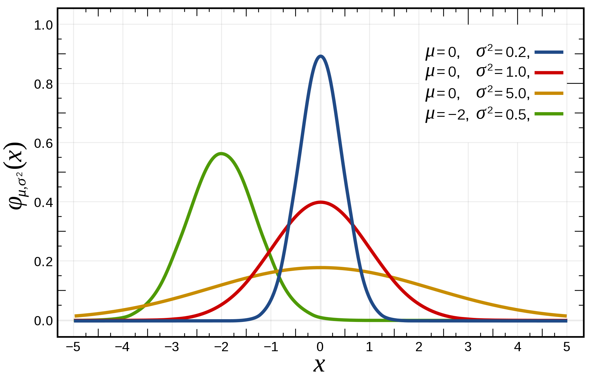
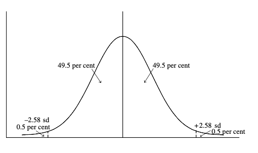

# Statistique descriptive univariée

Le cours précédent était consacré à vous présenter différents types de variables. Celui de cette semaine présente les premiers éléments de **statistique descriptive univariée**, les outils permettant la description d'une unique variable. Ces outils dépendent de la nature de la variable étudiée.

## Variables qualitatives

### Tris à plat

Pour décrire ce genre de variable, le principal traitement statistique est de compter le nombre d'individus correspondant à chaque modalité de la variable. C'est ce qu'on appelle un **tri à plat** (par opposition aux tris croisés qui font intervenir plusieurs variables). Un exemple issu des données du titanic (voir section \@ref(tab:titanic)).

```{r, echo = FALSE, message=FALSE}
library(titanic)
library(tidyverse)
library(kableExtra)
library(questionr)
library(gtsummary)
library(labelled)
theme_gtsummary_language("fr", decimal.mark = ",", big.mark = " ")
```

```{r, echo = FALSE}
freq(titanic_train$Pclass, total = TRUE, exclude = NA) %>% kable()
```

À partir d'un tableau comportant une ligne par passager, on produit donc un tableau qui comporte seulement une ligne par classe de passagers. La colonne d'effectif montre le nombre de passagers par classe, tandis que la colonne de pourcentage indique le pourcentage de passagers des différentes classes parmi l'ensemble de passagers du Titanic. On peut lire le tableau de cette manière : parmi les 891 passagers du Titanic, 216 voyageaient en première classe. On calcule le pourcentage de chaque catégorie en divisant l'effectif de chaque catégorie par l'effectif total, puis en multipliant par 100 ($\frac{216}{891}*100 = 24,2 \%$).

Dans le cas où la variable est qualitative ordinale (c'est-à-dire qu'on peut ordonner ses modalités de manière hiérarchique, comme c'est le cas pour la variable de classe), on peut présenter dans ce tableau les **pourcentages cumulés**.

```{r, echo = FALSE}
questionr::freq(titanic_train$Pclass, cum = TRUE, total = TRUE, exclude = NA) %>% kable()
```

Ici, le chiffre 44,9% représente le pourcentage des passagers qui voyageaient **au moins en seconde classe**. Il s'agit simplement de la somme des pourcentages des passagers des première et seconde classe. La ligne suivante indique le pourcentage de passagers qui voyageaient au moins en troisième classe, ce chiffre est donc logiquement égal à 100%.

### Diagrammes en barre

La représentation graphique associée à ce décompte est ce qu'on appelle généralement un **diagramme en barre** (vous pouvez aussi trouver "diagramme en bâtons ou diagramme en "tuyaux d'orgue" qui désignent la même chose). Sur ce diagramme, on trace des barres verticales dont les hauteurs sont proportionnelles aux effectifs du tri à plat. Seule la hauteur des barres à une signification, la largeur est totalement arbitraire.

```{r, caption = "Diagramme en tuyau d'orgue représentant le nombre de passagers dans chaque classe du Titanic", echo = FALSE, fig.width= 4}

myplot <- ggplot(titanic_train, aes(Pclass, fill = Survived)) + geom_bar() +
  labs(x= 'Classe', y = 'Effectifs')

print(myplot)
```

## Variables quantitatives

Si la statistique univariée est très simple pour une variable qualitative, elle peut faire l'objet d'analyses plus approfondies lorsqu'on dispose de variables quantitatives.

### Mesures de dispersion

La semaine dernière, je vous ai présenté quelques **mesures de tendance centrale**. Elles donnent des renseignements importants pour décrire une variable, mais n'en résument qu'une dimension. Deux séries statistiques peuvent avoir la même moyenne tout en étant très différentes.

Comparez par exemple ces deux séries de chiffres, qui représentent des profits (fictifs) en dollars de deux agriculteurs de deux régions A et B :

-   A: 14, 16, 18, 20, et 22
-   B: 2, 8, 18, 29, et 33

La somme de ces deux série est la même, 90 dollars, mais il apparaît rapidement que l'une des séries est beaucoup plus **dispersée** que l'autre, c'est-à-dire que les écarts par rapport à la moyenne sont en général beaucoup plus grands (la série B). Notre vision des risques et des profits liés à l'agriculture est informée par cette différence, et nous devrions en inclure des indices dans toute description statistique de cette variable.

Pour faire cela, nous avons besoin de mesures permettant de décrire la disperion des modalités de la variable autour de sa moyenne.

#### L'étendue

C'est la différence entre la plus grande et la plus petite valeur de la série :

$$R = X_{max} - X_{min}$$

C'est une mesure de dispersion assez basique. Son défaut est assez évident : elle dépend uniquement des valeurs extrêmes, et aucunement du reste de la distribution.

#### L'écart interquartile

Pour prendre en compte plus que les deux valeurs extrêmes, on peut calculer la différence entre deux quantiles, des quartiles par exemple (voir définition dans le premier cours)

$$ Q_d = Q_3 - Q_1 $$

C'est un mesure un peu meilleure que l'étendue, parce que le maximum et le minimum sont des valeurs qui donnent généralement peu d'information sur la distribution en général. Cet écart représente l'étendue de la moitié de la distribution, moitié obtenue après avoir enlevé les 25% des valeurs les plus faibles et 25% des valeurs les plus hautes. L'écart interquartile est moins sensible aux valeurs extrêmes que l'étendue (puisqu'on les a supprimées), mais résume tout de même l'ensemble de données sans prendre en compte la variabilité des données entre le premier et le 3ème quartile. Les mesures suivantes n'ont pas ces défauts.

#### La variance

<!-- In making this calculation the sign of the deviation (i.e. whether the value of the observation is higher or lower than the mean) has to be ignored. If not, the sum of the positive deviations would always be exactly equal to the sum of the negative deviations. Since these two sums would automatically cancel out, the result would always be zero. -->

<!-- The mean deviation does take account of all the observations in the series and is easy to interpret. However, it is less satisfactory from a theoretical statistical point of view than the next two measures. -->

Ce qu'on voudrait, c'est l'équivalent de la moyenne, mais pour mesurer la dispersion. On pourrait donc se dire qu'il suffirait de faire la **moyenne des écarts à la moyenne** de cette manière [^indicateurs-1]:

[^indicateurs-1]: Les deux côtés de l'équation représentent la même chose, il s'agit juste d'une différence de notation. À gauche, on utilise ... pour indiquer la série de termes supplémentaires qu'on va inclure dans l'addition mais qu'on n'écrira pas. À droite, l'opérateur $\sum_{i = 1}^{n}$ est la somme pour i allant de 1 à n de l'expression qui est à droite. Cela signifie qu'il faut remplacer i par 1, puis par 2, 3, etc. jusqu'à n et faire la somme de tous les éléments ainsi obtenu. Ce qui revient exactement à ce qui est écrit de manière plus longue de l'autre côté de l'équation.

$$ \frac{1}{N}( (X_1 - X_m) + (X_2 - X_m) + ... + (X_n - X_m) = \frac{1}{n} \sum_{i = 1}^{n} (X_i - X_m) $$

Le problème, en faisant ça, c'est que compte tenu de la définition de la moyenne, les écarts à la moyenne vont se compenser terme à terme. On peut le voir facilement si l'on sépare la somme en deux :

$$ \frac{1}{n} \sum_{i = 1}^{n} (X_i - X_m) = \frac{1}{n} \sum_{i = 1}^{n} X_i - \frac{1}{n} \sum_{i = 1}^{n} X_m $$

Du côté droit de l'équation, le terme de gauche ($\frac{1}{n} \sum_{i = 1}^{n} X_i$) est la définition de la moyenne (c'est la somme des termes $X_1+X_2+...+X_n$ divisé par l'effectif total n), tandis qu'à droite ($\frac{1}{n} \sum_{i = 1}^{n} X_m$) on ajoute n fois la moyenne $X_m$ puis on la divise par n, donc on obtient encore la moyenne. Au final, cette somme est toujours égale à 0.

Pour éviter ce problème, on définit la variance comme la somme des écarts à la moyenne **au carré**.

$$ Var = \frac{1}{n} \sum_{i = 1}^{n} (X_i - X_m)^2 $$

Cette définition a l'avantage de donner un résultat non nul, excepté dans le cas où la variable est une constante (qui est alors toujours égale à sa moyenne). Surtout, les écarts à la moyenne s'ajoutent, qu'ils soient générés par des valeurs supérieures ou inférieures à la moyenne.

#### L'écart type

La variance a beaucoup de propriétés intéressantes et on l'utilise très largement en statistique. Malgré tout, elle a un dernier inconvénient, c'est de s'exprimer comme un carré de l'unité dans laquelle est mesurée la variable. Par exemple, si l'on mesure la taille des étudiant-es de la classe puis qu'on calcule la variance, on aura un résultat en centimètres ou en mètres au carré. Dans notre exemple, on obtient une mesure en "dollars au carré", dont le sens est difficile à interpréter.

On résoud ce problème de manière simple en calculant la racine carrée de la variance. Cette opération nous permet d'obtenir notre dernière mesure de dispersion, **l'écart-type**.

$$ \sigma = \sqrt{\frac{1}{n} \sum_{i = 1}^{n} (X_i - X_m)^2} $$

L'écart-type est la mesure de dispersion la plus utile et la plus fréquente. Elle est meilleure que la variance car elle se mesure dans la même unité que la variable en question. Par exemple, on peut dire que dans la région A, la moyenne des revenus agricoles est de 18 dollars, avec un écart-type de 2,8 dollars.

### Représentations graphiques

Il existe plusieurs manières de représenter graphiquement la distribution d'une variable quantitative.

#### Histogramme

Les histogrammes sont l'équivalent des diagrammes en barres pour les variables quantitatives. Chaque barre (ou rectangle) qui compose l'histogramme a une aire qui est proportionnelle au nombre d'observation dont les valeurs sont dans l'intervalle sur lequel s'étend le rectangle.

```{r, echo = F, fig.width=4, fig.cap="Distribution de l'âge des passagers du Titanic. Chaque rectangle a une largeur de 3 ans"}
titanic_train %>%  filter(is.na(Age) == F) %>% ggplot(aes(Age, fill = Survived)) + geom_histogram(binwidth = 3)
```

Comme il s'agit de variables quantitatives, on peut choisir le nombre de rectangles comme on le souhaite (contrairement aux variables qualitative dont les modalités sont définies une fois pour toutes). Ici, on représente la même variable avec moins de rectangles.

```{r, echo = F, fig.width=4, fig.cap="Même figure avec une largeur de 8 ans"}
titanic_train %>%  filter(is.na(Age) == F) %>% ggplot(aes(Age, fill = Survived)) + geom_histogram(binwidth = 8)
```

Ici avec un plus grand nombre de rectangle (largeur = 1 an)

```{r, echo = F, fig.width=4, fig.cap="Même figure avec une largeur d'un an"}
titanic_train %>%  filter(is.na(Age) == F) %>% ggplot(aes(Age, fill = Survived)) + geom_histogram(binwidth = 1)
```

#### Densité

On représente parfois les variables quantitatives par une courbe que l'on appelle une 'densité'. C'est la courbe qu'on pourrait obtenir si on avait un très grand nombre de passagers et qu'on représentait l'histogramme avec des rectangles très fins.

On peut également produire une estimation de cette courbe à partir d'une transformation effectuée sur les histogrammes. Si l'on trace une ligne qui passe au milieu de chacun des segments supérieurs des rectangles qui composent l'histogramme, on obtient alors un graph qu'on nomme un **polygone de fréquence**.

{width="300px"}

La forme de ce polygone peut être être "lissée" à l'aide de techniques mathématiques, pour donner la courbe de densité recherchée. Elle donne une idée de la forme du polygone de fréquence si l'on avait un très grand nombre d'individu dans notre échantillon.



Ces représentations graphiques sont un bon moyen de visualiser la **forme** de la distribution d'une variable quantitative continue, et spécifiquement de la manière dont les données sont réparties autour de leur valeur "centrale".

#### Asymétrie (*skewness*)

Une manière de caractériser les distribution est leur symétrie par rapport à la moyenne. Les valeurs peuvent en effet être réparties de manière symétrique de part et d'autre de la moyenne, ou bien de manière asymétrique (*skewed*).

![Distributions symétriques et asymétriques [@feinstein2002, p.54]](images/skewed.png)

Différentes mesures permettent de quantifier l'asymétrie d'une distribution.

-   Elles doivent être indépendantes de l'unité de mesure
-   Et elle doivent être nulles lorsque la distribution est symétrique.

Un exemple de coefficient d'asymétrie est le suivant, mais il en existe d'autres :

$$ Skewness = \frac{3*(Mean - Median)}{\sigma} $$

Un exemple de variable dont la distribution est asymétrique est la distribution des revenus dans la population française. L'histogramme suivant représente la distribution du niveau de vie (c'est le revenu des ménages divisé par le nombre d'[unités de consommation](https://www.insee.fr/fr/metadonnees/definition/c1890)). Le niveau de vie médian (compris dans la portion verte du graphique) est inférieur au niveau de vie moyen, car les ménages au niveaux de vie très élevés (en bleu) tirent la moyenne vers le haut, mais n'ont pas d'effet sur la médiane.


## La loi normale : une distribution importante

La loi normale est une distribution théorique, définie à partir de son expression mathématique. Mais bien que théorique, c'est une distribution très importante, car elle est souvent utilisée comme approximation de distributions réelles. Je vous la présente ici rapidement, on la retrouvera dans des prochaines séances.

Pour définir une loi normale, il faut connaître deux constantes : sa moyenne $X_m$ et l'écart type $\sigma$. L'équation donne la valeur de Y (la hauteur de la courbe, qui apparaît sur l'axe des ordonnées) pour tout valeur de X (mesuré sur l'axe des abscisses) :

$$ Y(X) = \frac{1}{ \sigma \sqrt{2\pi}} exp(- \frac{(X - X_m)^2}{2*\sigma^2})$$

La fonction $exp()$ qui apparaît dans la formule est la **fonction exponentielle**. Si vous ne connaissez pas cette fonction, sachez qu'elle est définie par le fait qu'il s'agit de l'unique fonction $f(x)$ qui est toujours égale à sa dérivée (la fonction dérivée est celle qui mesure la pente de la courbe en chaque point, on la note $f'(x)$ : elle est positive lorsque $f$ est croissante, et négative lorsqu'elle est décroissante) et qui est égale à 1 lorsque $x = 0$. Comme elle est toujours égale à sa dérivée, plus $x$ est élevé, plus la fonction exponentielle doit avoir une dérivée élevée, donc plus elle doit croître rapidement.

```{r, fig.cap="Graphe de la fonction exponentielle entre -5 et 5"}
curve(exp(x), from=-5, to=5, , xlab="x", ylab="y")
```

Dans la distribution de la loi normale, la fonction exponentielle contient une expression qui est toujours inférieure ou égale à zéro. Son maximum est donc atteint lorsque $X$ est égal à sa moyenne $X_m$, auquel cas $Y(X_m) = \frac{1}{ \sigma \sqrt{2\pi}}$. Plus $X$ va s'éloigner de sa moyenne, plus $Y(X)$ sera faible, on dit que la distribution \*tend vers 0 lorsque X tend vers "moins l'infini" ou "plus l'infini". Le graphe de la loi normale ressemble donc à un dos d'âne, ce qui explique qu'on l'appelle aussi "la courbe en cloche".

 Ce dernier graphe permet de constater que, si les lois normales ont toutes la même allure, leur forme dépend de la moyenne et de l'écart-type de la distribution. Comme déjà évoqué, la moyenne indique le maximum de la courbe. L'écart-type détermine lui la "largeur" de la bosse, c'est-à-dire à quel point les données s'étalent autour de la moyenne.

Une propriété importante de la loi normale est que, quelque soit sa moyenne et son écart-type, il y a toujours une même proportion d'observations qui seront distribués à une certaine distance de la moyenne (que l'on peut mesurer en calculant l'aire sous la courbe), mesurée en nombre d'écarts-type.

Par exemple :

-   **90% des observations** sont situés à moins de **1,645 écarts-type** autour de la moyenne, laissant 5% de chaque côté.
-   **95% des observations** sont situés à moins de **1,96 écarts-type** autour de la moyenne, laissant 2,5% de chaque côté.
-   **99% des observations** sont situés à moins de **2,58 écarts-type** autour de la moyenne, laissant 0,5% de chaque côté.


